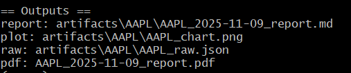
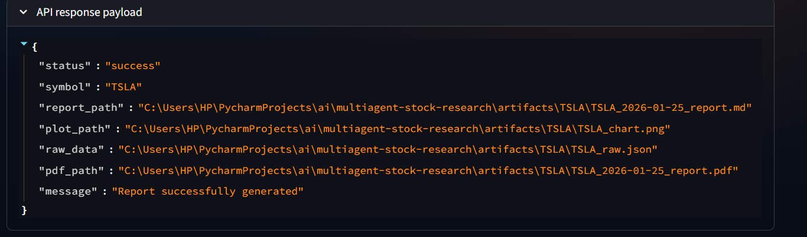
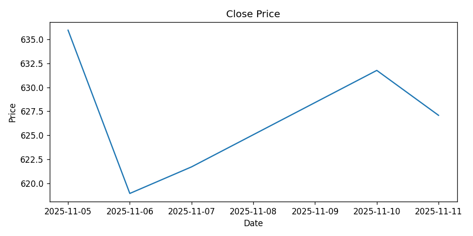
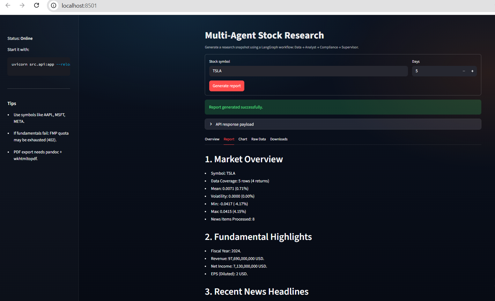

# Multi Agent Stock Research (Powered by LangChain + LangGraph)

[](https://www.python.org/downloads/)
[](https://github.com/langchain-ai/langchain)

[](LICENSE)
[](https://fastapi.tiangolo.com)
[](https://platform.openai.com)


---

## Why This Project Exists

The world of financial research has evolved — analysts now rely on automation, AI, and real-time data instead of Excel sheets and manual fundamentals.  
This project demonstrates a **Minimal-production-ready multi-agent research system** built using **LangChain + LangGraph**, designed to automate:

-  Historical stock price analysis  
-  Fundamental data fetching
-  News tracking
-  Analyst-style report generation
-  Compliance filtering
-  PDF + Markdown Research Reports with charts

Whether you're a developer, quant researcher, analyst, or AI enthusiast — this repo shows how to build **real-world LLM-enabled workflows** that generate institutional-quality research without requiring paid API data feeds.

---

##  Key Features

| Feature                        | Description |
|--------------------------------|------------|
| **4-Agent Architecture**       | DataAgent, AnalystAgent, ComplianceAgent, SupervisorAgent |
| **Charts + Stats**             | Auto-generates return stats + matplotlib price chart |
| **Live News Feed Integration** | Fetches RSS news headlines related to your stock symbol |
| **PDF Report Generation**      | Produces clean markdown AND PDF research output |
| ️**Free Data Sources**        |yfinance + FMP "demo" endpoints + public RSS feeds |
| **FastAPI Endpoint**           | `/analyze` route returns report paths + JSON response |
| **Error Handling**             | Skips unknown symbols, logs edge cases, continues pipeline |
| **Human-In-Loop (Optional)** | Approve generated reports before publishing |

---

## Tech Stack

| Layer | Tech |
|-------|------|
| Orchestration | LangGraph, LangChain |
| Backend APIs | FastAPI |
| LLM Model | GPT-5 via OpenAI |
| Data Tools | yFinance, FinancialModelingPrep (fallback), RSS |
| File Formats | Markdown, JSON, PDF |
| Logging | Rotating log file via `logging` + `TimedRotatingFileHandler` |
| Code Quality | Black, Ruff, Pytest |
| PDF Rendering | Pandoc + wkhtmltopdf |
| Python | 3.10+ |

---
# Agent Responsibilities Matrix
| Agent                        | Primary Function                                                      | Input Dependencies           | Output Artifacts                                  | Tools Used                                        |
| ---------------------------- | --------------------------------------------------------------------- | ---------------------------- | ------------------------------------------------- | ------------------------------------------------- |
| **DataAgent**                | Fetches historical price data, key financial metrics, and recent news | Stock symbol, days           | `raw_data.json`, `prices`, `fundamentals`, `news` | yFinance, FMP API, RSS Parser                     |
| **AnalystAgent**             | Interprets data and writes narrative summary                          | DataAgent output             | Analyst Note (text)                               | GPT-5 (ChatOpenAI), LangChain PromptTemplate      |
| **ComplianceAgent**          | Validates phrasing and enforces neutral tone                          | Analyst Note                 | Compliant Final Note                              | LLM Compliance Filter, Rule-based Keyword Scanner |
| **SupervisorAgent**          | Merges all content, generates formatted Markdown & PDF report         | Compliant Note, Data Summary | `.md`, `.pdf`, `.png` artifacts                   | pypandoc, wkhtmltopdf, matplotlib                 |
| **Orchestrator (LangGraph)** | Directs data flow and ensures orderly execution                       | All agents                   | End-to-end automated workflow                     | LangGraph + FastAPI integration                   |

---
## Agent Responsibility Model

Each agent in this system has a clearly defined, non-overlapping role:

- **DataAgent**
  - Collects raw market data, fundamentals, and news
  - Produces structured JSON only (no interpretation)

- **AnalystAgent**
  - Interprets price action, fundamentals, and news
  - Produces narrative investment analysis

- **ComplianceAgent**
  - Enforces neutral tone and regulatory-safe phrasing
  - Removes prohibited language and injects disclosures
  - Does not generate new analysis

- **SupervisorAgent**
  - Acts as Editor-in-Chief
  - Decides final report structure
  - Removes incomplete or low-quality sections
  - Produces the final institutional-grade research note
---

## Installation

```bash
git clone https://github.com/mohanelango/multiagent-stock-research.git
cd multiagent-stock-research
python3 -m venv .venv
source .venv/bin/activate   # On Windows: .venv\Scripts\activate
pip install -r requirements.txt
cp .env.example .env
```
Edit `.env` and add your FMP_API_KEY from [https://site.financialmodelingprep.com/](FMP).  
Optionally tune `configs/settings.yaml` to select your preferred LLM provider (OpenAI,Gemini), max_news, strict_mode.

    ⚠️ Important: PDF export requires:
         1. pandoc (document conversion)
         2. wkhtmltopdf (HTML-to-PDF engine)
         3. pypandoc (Python binding to Pandoc) (already available in requirement.txt. So no need to install separately)

    (If you don’t have Chocolatey, install from https://chocolatey.org/install
    first — it’s one line. Once Done follow the below installation via chocolatey.)

🔹 Windows (via Chocolatey)
```bash
# Install Pandoc
choco install pandoc -y

# Install wkhtmltopdf
choco install wkhtmltopdf -y
```
🔹 macOS (via Homebrew)
```bash
# Install Pandoc
brew install pandoc

# Install wkhtmltopdf
brew install wkhtmltopdf
```
🔹 Linux (Debian/Ubuntu)
```bash
sudo apt update
sudo apt install python3-pip pandoc wkhtmltopdf -y

```
---
## ⚠️ API Quota & Strict Mode Behavior

Free Version of FinancialModelingPrep (FMP) demo API, which is subject to daily request limits.
When these limits are exceeded, API calls return a 402 Payment Required error.
In strict mode (default), the pipeline will abort gracefully and log a message such as:

```bash
Strict mode abort: missing critical data: income_statement, key_metrics_ttm for AAPL
Possible causes: free FMP quota exhausted, invalid API key, or unavailable ticker.
```
To continue testing even when quotas are reached:
```yaml
Strict Mode:
  strict_mode: false
```
Or set paid version of FMP_API_KEY in .env for uninterrupted data pulls.

---
## How It Works

Every time you run a stock analysis, four distinct agents collaborate:

1. Data Agent → Fetches prices, fundamentals, and news

2. Analyst Agent → Writes the narrative & market interpretation

3. Compliance Agent → Screens content for restricted words

4. Supervisor Agent → Merges, formats, and publishes outputs

They communicate via a LangGraph state machine and are orchestrated end-to-end through CLI or API.

---
## Architecture Overview


This architecture diagram shows how a stock symbol request flows through a LangGraph-powered multi-agent pipeline — from data collection, AI analysis, and compliance filtering to final report generation and artifact export.
For a deeper explanation, see [`docs/architecture.md`](docs/architecture.md)

---
# PDF Rendering and CSS Configuration

The report generator uses a clean CSS-driven template to ensure every exported PDF looks professional and consistent.
The file pdf.css governs typography, margins, and visual hierarchy — applied automatically during pypandoc → wkhtmltopdf conversion.

Example snippet:


```css
body {
  font-family: "Helvetica", "Arial", sans-serif;
  font-size: 12pt;
  line-height: 1.6;
  margin: 2cm;
}
h1 {
  font-size: 20pt;
  border-bottom: 2px solid #333;
}
ul { list-style-type: disc; margin-left: 1.2em; }
img { display: block; margin: 0 auto; }

```
This configuration produces clean, publication-ready PDFs with proper spacing, modern fonts, and uniform sectioning — essential for compliance-grade financial reports.

---
### Usage (CLI)
```bash
python -m src.cli --symbol AAPL --days 10 --outdir artifacts
```
### Sample CLI Output:

---
## REST API (FastAPI)
### Start the server:
```bash
uvicorn src.api:app --reload --port 8000
```
### Example call:
```
curl -X POST http://127.0.0.1:8000/analyze \
-H "Content-Type: application/json" \
-d '{"symbol":"META","days":10}'
```
### Sample API Output:

---
### Sample Chart Output:

---
## Results

The system has been tested on multiple tickers (AAPL, MSFT, META) across 7–10 day ranges, consistently generating complete reports that include:

1. Snapshots.
2. Fundamental Highlights
3. Recent News Headlines
4. Analyst Commentary
5. Methodology
5. Execution Metadata
6. Price chart and statistics.
7. Exported .pdf and .json artifacts

Each run executes with a live OpenAI API key, making it practical for near-real-time research report automation and  produces a complete report folder under artifacts / SYMBOL, containing:

```bash
AAPL_2025-11-09_report.md
AAPL_2025-11-09_report.pdf
AAPL_chart.png
AAPL_raw.json
```
---

## User Interface 
### Interactive web application using Streamlit
 - Streamlit frontend abstracts away backend complexity and calls FastAPI /analyze.
### Clear user guidance
- UI includes usage tips (example tickers, quota guidance, PDF export prerequisites).
### Error messaging
- Backend returns structured JSON errors (status=error, reason, optional suggested_action) surfaced to users.
### Run UI
```bash
streamlit run src/ui/streamlit_app.py

```
### Sample UI Output:

---
## Resilience & Monitoring 

### Retry logic with exponential backoff

- Implemented via src/utils/resilience.py and used in:
   - src/tools/fundamentals_tool.py (transient HTTP status retries)
   - src/tools/price_tool.py (transient yfinance failures)
### Timeout handling

 - Per-attempt timeouts enforced in retry wrapper.
 - Global workflow timeout enforced in orchestrator (ThreadPoolExecutor + fut.result(timeout=...)).
### Loop limits / iteration caps
- Orchestration graph is a finite DAG with fixed nodes (no unbounded loops by design).
### Graceful handling of agent failures
- AnalystAgent/ComplianceAgent failures fall back to safe defaults while preserving report generation.
- SupervisorAgent failures fall back to compliant text.
### Traceability
- Run-level context (run_id/symbol) is logged for correlating failures, retries, and fallback events.
---
## Logging, Maintenance, and Operations

- Logs are written to:
  - Console output (developer visibility)
  - Rotating file: logs/app.log (rotation enabled; UTF-8 encoding)

- Each pipeline run logs a unique run_id to support debugging across retries/failures.

- Recommended maintenance:
  - Keep RSS sources current (some feeds may return 404/429; retries are applied, but replace dead feeds).
  - If strict-mode is enabled, ensure your RSS sources and fundamentals provider are stable to avoid aborts.
  -  For PDF export, keep pandoc and wkhtmltopdf installed and available in PATH.
---
## Tests & Quality Assurance
### Comprehensive Testing Suite
- Unit tests cover core tools and agent behavior (data fetchers, agent output handling, strict-mode failure paths).
- Integration tests validate the orchestrator flow (agent-to-agent state passing, strict-mode abort, graceful degradation).
- End-to-end smoke tests exercise complete workflows via CLI/API entrypoints using mocks (to avoid external API dependency).
- Coverage reporting is enabled via pytest-cov for core modules.
### Run tests + coverage
```bash
pytest -q --disable-warnings --maxfail=1
pytest -q --cov=src --cov-report=term-missing

```
### Run a Single Test File
```bash
pytest tests/unit/agents/test_analyst_agent.py -v
```
---
## Safety & Security Guardrails 

#### Input validation / sanitization
 - Central request validation via validate_request() (symbol, days, outdir).
 - Ticker validity pre-check via yfinance before pipeline execution (rejects invalid/delisted symbols).
#### Output filtering / content safety
 - Neutrality enforcement via enforce_neutrality() and forbidden phrase filtering in the ComplianceAgent.
 - ComplianceAgent explicitly rewrites to remove prohibited claims and ensure regulatory-safe language.
#### Graceful error handling
 - Strict-mode abort produces structured, user-facing errors with suggested actions.
 - Non-strict mode proceeds with warnings and “N/A placeholders” where needed.
#### Logging for compliance/debug
 - Consistent structured logging across tools, agents, and orchestrator (including warnings/fallbacks).
---
## Contributing
PRs are welcome! Whether you're fixing a bug, improving PDF formatting, or adding a new tool — open a PR and let's build better agent workflows together.

---
## License
Distributed under the [MIT License](LICENSE).