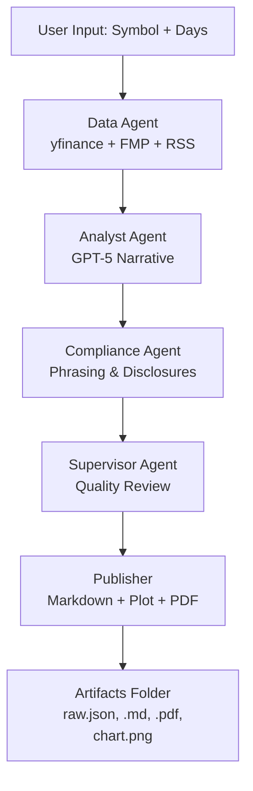

## Architecture – MultiAgent Stock Research System

This document provides a detailed look at the architecture of the MultiAgent Stock Research system — a LangGraph-powered, multi-agent orchestration pipeline designed for automated equity analysis, price charting, sentiment-driven narrative generation, and full PDF reporting.

---
### High-Level Overview

This project uses multiple specialized AI agents working in sequence and orchestrated via LangGraph, with LangChain tools for data and PDF exports.

#### Agents Involved

| Agent                | Responsibilities                                                        |
| -------------------- | ----------------------------------------------------------------------- |
| **Data Agent**       | Fetches historical prices, financials, and latest news for given ticker |
| **Analyst Agent**    | Generates investment commentary (GPT-5) using collected data            |
| **Compliance Agent** | Strips or flags forbidden phrases, enforces disclosures                 |
| **Supervisor Agent** | Validates agent outputs and suggests improvements                       |
---
### End-to-End Flow Diagram


---
### Module Breakdown
| Module                   | Description                                                        |
| ------------------------ | ------------------------------------------------------------------ |
| `src/agents/*.py`        | All agent classes (data, analyst, compliance, supervisor)          |
| `src/tools/*.py`         | yfinance, FMP API, RSS news, plot utils                            |
| `src/graph/orchestrator` | LangGraph pipeline builder + state transitions                     |
| `src/api.py`             | FastAPI backend (optional)                                         |
| `src/cli.py`             | CLI entry-point                                                    |
| `config/settings.yaml`   | Model settings, mode toggles (strict / relaxed), compliance config |
| `assets/pdf_style.css`   | PDF stylesheet                                                     |

### Detailed Agent Workflow
| Agent                   | Description                                                | Input Sources                                    | Output                                             |
| ----------------------- | ---------------------------------------------------------- | ------------------------------------------------ | -------------------------------------------------- |
| 🟦 **Data Agent**       | Collects raw market data (prices, fundamentals, headlines) | `yfinance`, FinancialModelingPrep API, RSS Feeds | `prices.json`, `fundamentals.json`, `news.json`    |
| 🟩 **Analyst Agent**    | Converts raw data into narrative commentary using GPT-5    | DataAgent bundle                                 | Markdown-ready insight block                       |
| 🟥 **Compliance Agent** | Removes banned phrases & adds legal disclaimers            | Analyst output                                   | Safe, compliant analyst note                       |
| 🟨 **Supervisor Agent** | Merges data + narrative + charts into final report         | All previous agent outputs                       | `report.md`, `report.pdf`, `chart.png`, `raw.json` |

---

#### Supported Modes

| Mode      | Behavior                                             |
| --------- | ---------------------------------------------------- |
| `strict`  | Pipeline stops if critical data missing or API fails |
| `relaxed` | Fills blanks with “N/A” and continues report         |

To override strict behavior, edit:
```yaml
# config/settings.yaml
strict_mode: false
```
